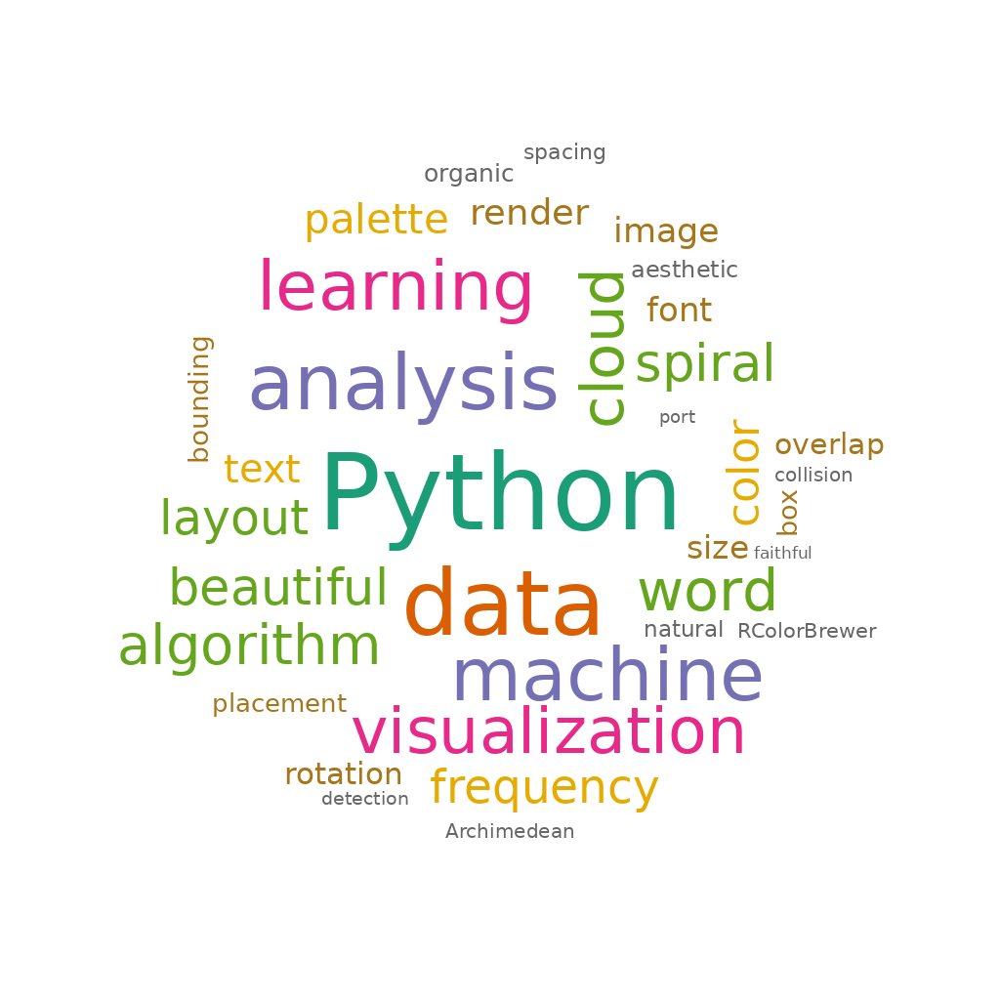

# r-wordcloud

A Python port of R's [`wordcloud`](https://github.com/ifellows/wordcloud) package by Ian Fellows.

Single file. Pure Python. Only dependency: Pillow.



## Why?

R's original `wordcloud` package produces word clouds with a distinctive organic, loosely-packed aesthetic that many people (myself included) find more pleasant than denser alternatives like `wordcloud2` or Python's `word_cloud`. The secret is simple: Archimedean spiral placement + bounding-box collision — words don't pack pixel-tight, so there's natural breathing room.

I tried to port this years ago, thought the algorithm was in C and too complex. Turns out the C++ (`layout.cpp`) is just a 40-line AABB overlap check. The actual algorithm is ~50 lines of R. [Claude Opus 4.6 ported it in a few minutes.](https://claude.ai/share/a0c8d285-5fd9-47a8-a6b1-5184b9e375f8)

## Usage

```python
from r_wordcloud import wordcloud

# From word frequencies
img = wordcloud(
    {"python": 100, "data": 85, "analysis": 70, "machine": 65, "learning": 60},
    palette="Dark2",
    seed=42,
)
img.save("my_cloud.png")
```

### From raw text

```python
from r_wordcloud import wordcloud_from_text

img = wordcloud_from_text(
    open("my_document.txt").read(),
    palette="BuGn",
    scale=(6, 0.8),
    rot_per=0.15,
)
img.save("my_cloud.png")
```

## Parameters

| Parameter | Default | Description |
|---|---|---|
| `frequencies` | (required) | Dict of `{word: count}` |
| `width`, `height` | 800 | Image size in pixels |
| `scale` | `(4, 0.5)` | `(max_cex, min_cex)` — controls font size range |
| `palette` | `"Dark2"` | RColorBrewer palette name or list of hex colors |
| `rot_per` | `0.1` | Proportion of words rotated 90° |
| `random_order` | `False` | Place words randomly instead of by frequency |
| `random_color` | `False` | Assign colors randomly instead of by frequency |
| `min_freq` | `1` | Minimum frequency to include |
| `max_words` | `200` | Maximum number of words |
| `background_color` | `"#FFFFFF"` | Background color |
| `font_path` | `None` | Path to .ttf/.otf font file |
| `base_font_size` | `16` | Base font size multiplied by cex |
| `seed` | `None` | Random seed for reproducibility |

## Available palettes

All built-in RColorBrewer palettes:

**Qualitative:** `Dark2`, `Set1`, `Set2`, `Set3`, `Accent`, `Paired`, `Pastel1`, `Pastel2`

**Sequential:** `Blues`, `Greens`, `Oranges`, `Reds`, `Purples`, `Greys`, `BuGn`, `BuPu`, `YlOrRd`, `YlGnBu`, `RdYlGn`

**Diverging:** `RdBu`, `Spectral`

Or pass your own: `palette=["#E41A1C", "#377EB8", "#4DAF4A"]`

## Install

Just copy `r_wordcloud.py` into your project. It's one file.

```
pip install Pillow  # only dependency
```

## Credits

- Original R `wordcloud` package by [Ian Fellows](https://github.com/ifellows/wordcloud) (LGPL-2.1)
- RColorBrewer palettes by Cynthia Brewer
- Ported to Python with [Claude Opus 4.6](https://claude.ai/share/a0c8d285-5fd9-47a8-a6b1-5184b9e375f8) (Anthropic)
- This port is MIT licensed
